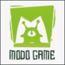

><strong>张元涛</strong>&nbsp;男 | 1991 | 福建-龙岩 | 工作经验-5年 
>
>&nbsp;教育背景：本科-龙岩学院 | 软件工程 | CET4 | 数据库工程师四级 
>&nbsp;岗位意向：游戏研发工程师 
>&nbsp;联系方式：13959290970 

<<strong>工作经历</strong>/>

><strong>2018.4-至今&ensp;四三九九网络股份有限公司&ensp;游戏开发工程师</strong>
>  
>使用 `Egret`引擎开发实时网络对战游戏、休闲单机游戏。 
>使用流行的`FairyGUI`UI框架，熟悉`DragonBones`龙骨换装。 
>熟悉游戏开发常见的状态同步、帧同步，熟悉客户端性能优化的一般方法。 
>各项目主要功能技术难点攻关，撰写技术文档。 
>任前端组长，参与前端框架补充与完善，工具组件开发，前端规范完善。 
>项目经历：《八分音符》《飞跃吧》《射箭对决》《羽毛球高手》《乱战英豪》《天黑请闭眼》《停车达人》《花样溜冰》

>---
><strong>2017.6-2018.4&ensp;摩多科技有限公司&ensp;游戏开发工程师</strong>
>  
>项目主开发，双端开发，项目基础框架搭建，主要功能效果实现。 
>参与游戏的需求分析、设计、编码实现等开发工作。 
>客户端采用`Egret`引擎、使用`DragonBones`制作动画，服务端使用`NodeJS`语言、`MongoDB`数据库。 
>项目经历：《妖怪来了》《流言侦探》

>---
><strong>2015.2-2017.6&ensp;吉比特网络技术股份有限公司&ensp;游戏开发工程师</strong>
>  
>前期主要使用`Unity3d`引擎参与项目的预研开发，demo制作，Unity技术探索。 
>后期使用`FlashBuilder`参与了TCG卡牌游戏的制作。 
>双端开发，负责前后端功能系统、数据库的设计与实现，撰写技术文档。 
>服务端使用`C#`/`MySQL`/`VisualStudio`，客户端使用`AS3`/`Lua`/`FlashBuilder`/`Unity3d` 
>项目经历：《RumbleBurst》《乱战》《波波利小镇》

<<strong>业余开发</strong>/>

>在业余期间使用`Egret`和`CocosCreator`开发微信小游戏。 
>项目经历：《经典泡泡龙传奇》《猜灯谜大作战》《飞跃行星》

<<strong>自我评价</strong>/>

>熟悉使用Unity、Egret、CocosCreator 进行游戏开发，积累了诸多类型游戏项目经验。 
>具备客户端(Unity/Flash/Egret/CocosCreator)+服务端(C#/NodeJS)开发经验，能胜任双端开发。 
>具备分析解决疑难问题的能力，钻研游戏技术难点，注重经验总结记录，习惯归纳整理。 
>良好的开发习惯与编码规范，乐于学习跟进游戏开发技术和资讯，关注游戏领域动态。 
>团队工作中不盲目执行，勤思考，提出优化和建议，持续发现及改进工作方法提高开发效率。 
>态度端正，人际关系优，完美主义者。伪文艺程序猿，静喜书法动爱篮球，爱生活爱运动！ 

<i>
T
h
a
n
k
s
</i>

